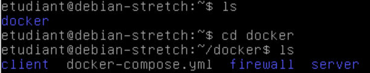
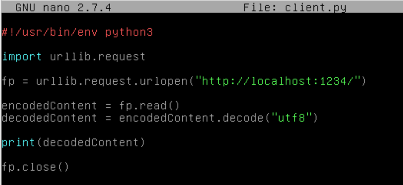
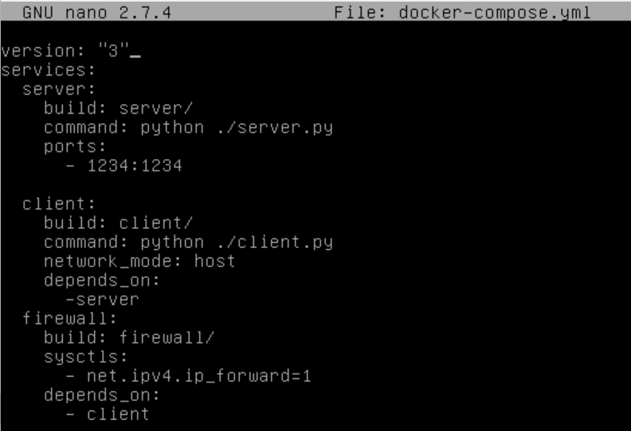

# Projet Docker
## Objectif du projet
Ce projet consiste à mettre en place une infrastructure composée d'un firewall, un client et un serveur. Ils seront chacun dans un container docker. Pour faciliter la communication entre les trois nous avons utilisé Docker Compose.

## Installation Docker
On fait une mise à jour: $ apt-get update  
La commande suivante permet d'installer docker: $ apt-get install docker-ce

## Installation Docker-compose
Pour cela: $ curl -L https://github.com/docker/compose/releases/download/v2.0.1/docker-compose-linux-x86_64 -o /usr/local/bin/docker-compose  
On vérifie que la nouvelle version est installée: 

## Infrastructure mis en place

## Contenu des fichiers

### Client
#### client.py

#### Dockerfile

### Server
#### server.py

#### DockerFile

#### index.html

### Firewall
#### clean.sh
#### firewall.sh
#### Dockerfile

### Docker-compose
#### docker-compose.yml

## Construction de Docker-compose 
Pour cela, on exécute la commande : $ docker-compose build

## Lancement de Docker-Compose
On exécute la commande suivante: $ docker-compose up
